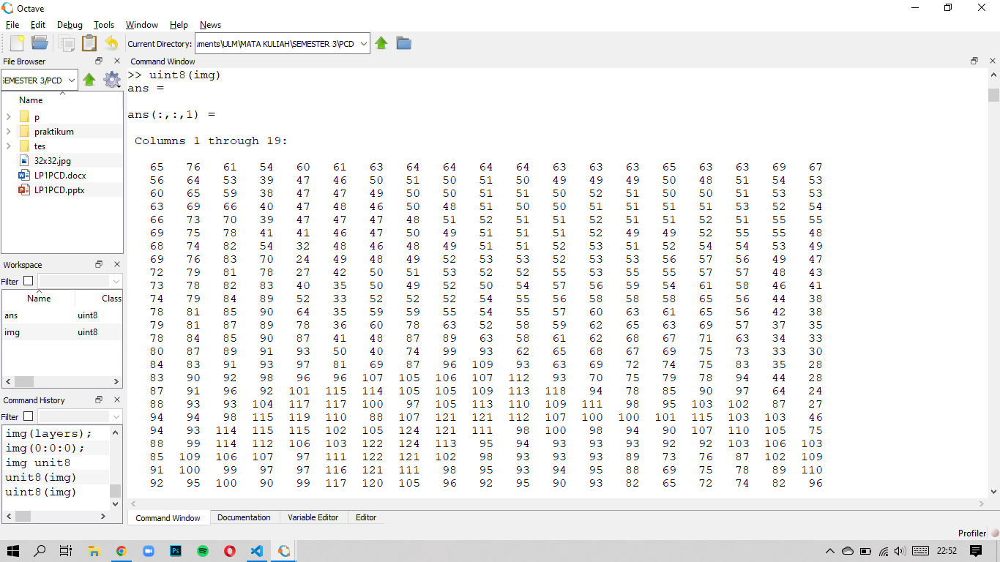
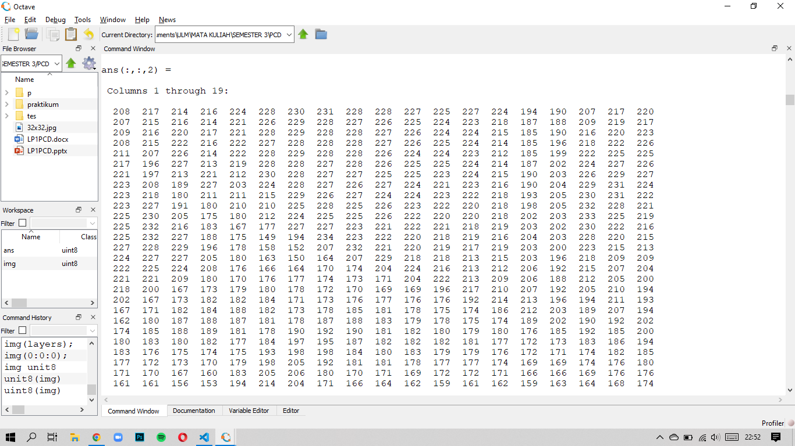
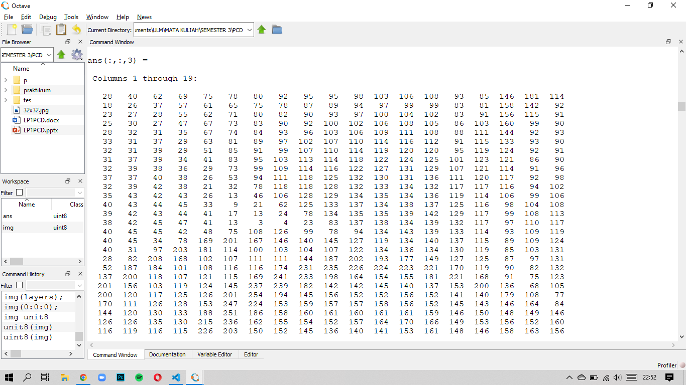
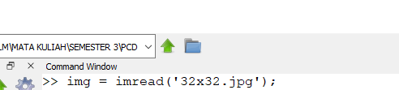
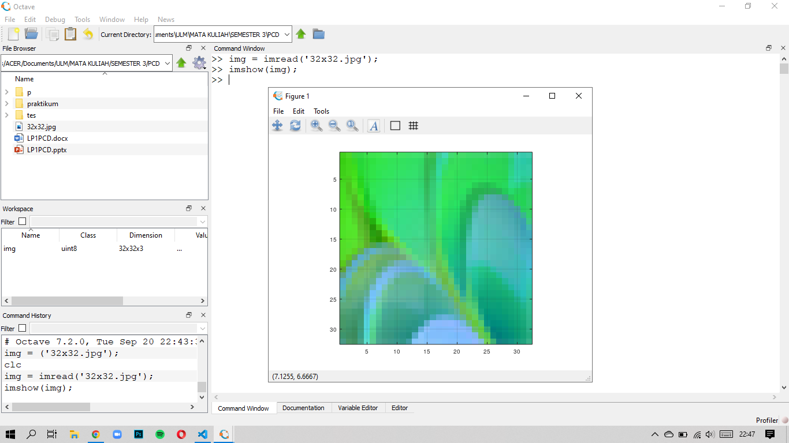
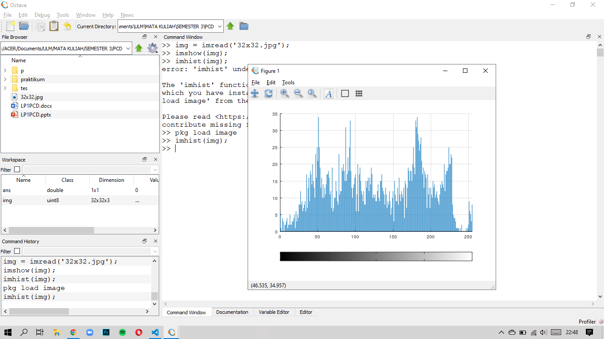

## __Tugas 2__
### __Khoyrur Roykhan (2110131210002)__

 

### __Package Image__
Adalah library yang menyediakan kumpulan fungsi untuk memproses gambar. Paket ini juga menyediakan fungsi untuk ekstraksi fitur, statistik gambar, transformasi spasial dan geometris, operasi morfologi, penyaringan linier, dan banyak lagi.

### __Contoh Gambar berwarna 32 x 32__

Dibawah ini merupakan gambar berwarna dengan ukuran 32 x 32 dengan format .jpg

Jumlah layer pada gambar tersebut adalah 3

- Layer 1

    

- Layer 2

    

- Layer 3

    

_unit8(img);_ --> untuk menampilkan pixel pada gambar yang tersimpan di variabel img.

### __Contoh Fungsi yang ada di Package Image__
- _imread_
    
    Fungsi untuk membaca dimana file image itu berada,
    contoh :

    

    _img_ adalah nama variabel untuk menyimpan file gambar tersebut.

- _imshow_

    Fungsi untuk menampilkan gambar,
    contoh :

    

    _imshow(img);_ --> akan menampilkan gambar yang ada pada variabel img. akan muncul gambar seperti di foto di atas.

- _imhist_

    Fungsi untuk menampilkan image dengan bentuk histogram,
    contoh :

    

    _imhist(img);_ --> akan menampilkan histogram dari gambar yang disimpan di variabel img.