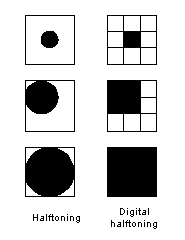
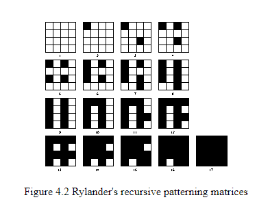
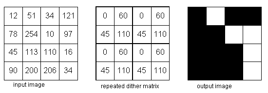
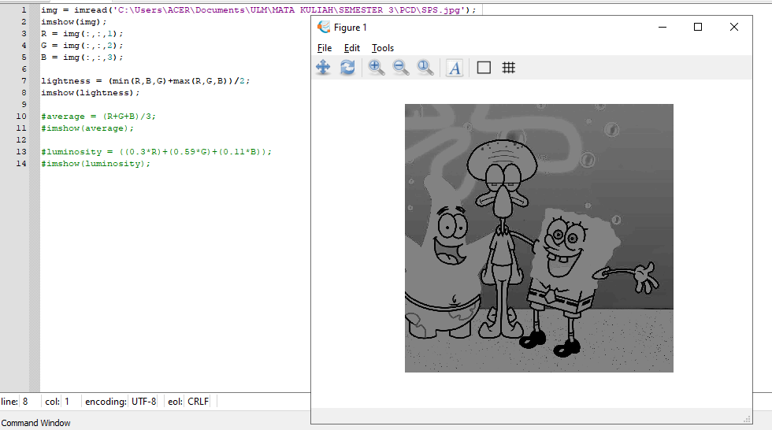
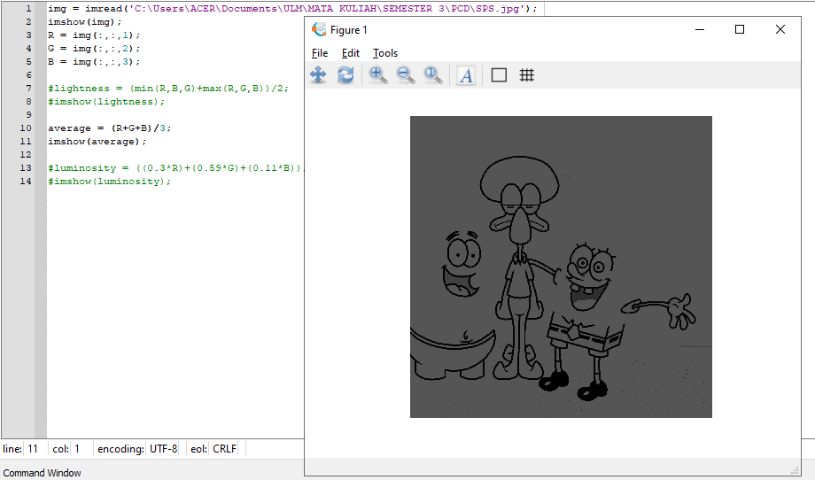
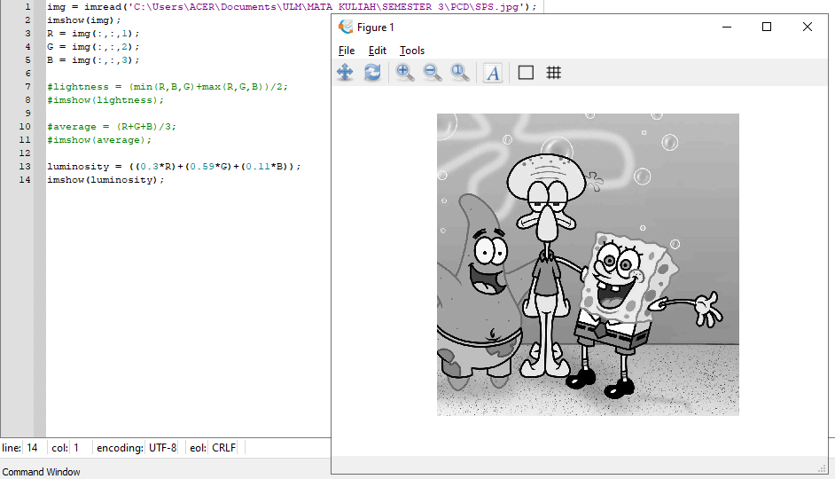

<h1 align="center"><b>TUGAS 3</b></h2>

<h1 align="center"><b>Pemrosesan Citra Digital</b></h2>

 

## __Penjelasan Halftoning, Pattering, Difhtering__

### __Halftoning__

&ensp;&ensp;&ensp;&ensp;Halftoning atau halftoning analog adalah proses yang mensimulasikan nuansa abu-abu dengan memvariasikan ukuran titik-titik hitam kecil yang diatur dalam pola yang teratur. Teknik ini digunakan dalam printer, serta industri penerbitan. Jika Anda memeriksa sebuah foto di koran, Anda akan melihat bahwa gambar itu terdiri dari titik-titik hitam meskipun tampaknya terdiri dari abu-abu. Hal ini dimungkinkan karena integrasi spasial yang dilakukan oleh mata kita. Mata kita memadukan detail halus dan merekam intensitas keseluruhan. Halftoning digital mirip dengan halftoning di mana gambar didekomposisi menjadi kotak sel halftone. Elemen (atau titik yang digunakan halftoning dalam mensimulasikan nuansa abu-abu) dari sebuah gambar disimulasikan dengan mengisi sel halftone yang sesuai. Semakin banyak jumlah titik hitam dalam sel halftone, semakin gelap sel tersebut. Misalnya, pada Gambar 4, sebuah titik kecil yang terletak di tengah disimulasikan dalam halftoning digital dengan mengisi sel halftone tengah; demikian juga, titik ukuran sedang yang terletak di sudut kiri atas disimulasikan dengan mengisi empat sel di sudut kiri atas. Titik besar yang menutupi sebagian besar area pada gambar ketiga disimulasikan dengan mengisi semua sel halftone.

 

### __Pattering__

&ensp;&ensp;&ensp;&ensp;Patterning adalah yang paling sederhana dari tiga teknik untuk menghasilkan gambar halftoning digital. Ini menghasilkan gambar yang memiliki resolusi spasial lebih tinggi daripada gambar sumber. Jumlah sel halftone citra keluaran sama dengan jumlah piksel citra sumber. Namun, setiap sel halftone dibagi lagi menjadi kotak 4x4. Setiap nilai piksel input diwakili oleh jumlah kotak terisi yang berbeda dalam sel halftone. Karena kisi 4x4 hanya dapat mewakili 17 tingkat intensitas yang berbeda, gambar sumber harus dikuantisasi.

 

### __Dithering__

&ensp;&ensp;&ensp;&ensp;Teknik lain yang digunakan untuk menghasilkan gambar halftoning digital adalah dithering. Tidak seperti pola, dithering membuat gambar keluaran dengan jumlah titik yang sama dengan jumlah piksel pada gambar sumber. Dithering dapat dianggap sebagai thresholding gambar sumber dengan matriks gentar. Matriks diletakkan berulang kali di atas gambar sumber. Dimanapun nilai piksel gambar lebih besar dari nilai dalam matriks, titik pada gambar output diisi. Masalah dithering yang terkenal adalah menghasilkan artefak pola yang diperkenalkan oleh matriks ambang batas tetap. 

 

## __Menggubah Gambar Menjadi Grayscale__

### __Lightness Method__

&ensp;&ensp;&ensp;&ensp;Algoritmanya adalah mencari nilai tertinggi dan terendah dari nilai R G B, kemudian nilai tertinggi dan terendah tersebut dijumlahkan kemudian dibagi 2. 

___lightness = (min(R,B,G)+max(R,G,B))/2;___

Contoh dan Hasil pada gambar dibawah :

### __Average Method__

&ensp;&ensp;&ensp;&ensp;Algoritmanya adalah dengan menjumlahkan seluruh nilai R G B, kemudian dibagi 3, sehingga diperoleh nilai rata-rata dari R G B, nilai rata-rata itulah yang dapat dikatakan sebagai grayclase. 

___average = (R+G+B)/3;___

Contoh dan Hasil pada gambar dibawah :

### __Luminosity Method__

&ensp;&ensp;&ensp;&ensp;Algoritmanya adalah dengan mengalikan setiap nilai R G B dengan konstanta tertentu yang sudah ditetapkan nilainya, kemudian hasil perkalian seluruh nilai R G B dijumlahkan satu sama lain.

___luminosity = ((0.3*R)+(0.59*G)+(0.11*B));___

Contoh dan hasil pada gambar dibawah:

