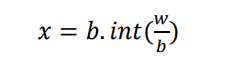
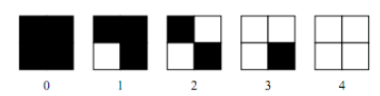
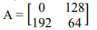
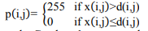
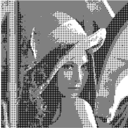
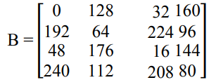
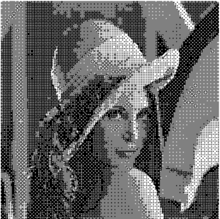

<h1 align="center"><b>TUGAS 3</b></h2>

<h1 align="center"><b>Pemrosesan Citra Digital</b></h2>

 

## __Penjelasan Halftoning, Pattering, Difhtering__

### __Halftoning__

&ensp;&ensp;&ensp;&ensp;Halftoning atau halftoning analog adalah proses yang mensimulasikan nuansa abu-abu dengan memvariasikan ukuran titik-titik hitam kecil yang diatur dalam pola yang teratur. Teknik ini digunakan dalam printer, serta industri penerbitan. Jika Anda memeriksa sebuah foto di koran, Anda akan melihat bahwa gambar itu terdiri dari titik-titik hitam meskipun tampaknya terdiri dari abu-abu. Hal ini dimungkinkan karena integrasi spasial yang dilakukan oleh mata kita. Mata kita memadukan detail halus dan merekam intensitas keseluruhan. Halftoning digital mirip dengan halftoning di mana gambar didekomposisi menjadi kotak sel halftone. Elemen (atau titik yang digunakan halftoning dalam mensimulasikan nuansa abu-abu) dari sebuah gambar disimulasikan dengan mengisi sel halftone yang sesuai. Semakin banyak jumlah titik hitam dalam sel halftone, semakin gelap sel tersebut. Misalnya, pada Gambar 4, sebuah titik kecil yang terletak di tengah disimulasikan dalam halftoning digital dengan mengisi sel halftone tengah; demikian juga, titik ukuran sedang yang terletak di sudut kiri atas disimulasikan dengan mengisi empat sel di sudut kiri atas. Titik besar yang menutupi sebagian besar area pada gambar ketiga disimulasikan dengan mengisi semua sel halftone.

 

### __Pattering__

&ensp;&ensp;&ensp;&ensp;Patterning adalah yang paling sederhana dari tiga teknik untuk menghasilkan gambar halftoning digital. Ini menghasilkan gambar yang memiliki resolusi spasial lebih tinggi daripada gambar sumber. Jumlah sel halftone citra keluaran sama dengan jumlah piksel citra sumber. Namun, setiap sel halftone dibagi lagi menjadi kotak 4x4. Setiap nilai piksel input diwakili oleh jumlah kotak terisi yang berbeda dalam sel halftone. Karena kisi 4x4 hanya dapat mewakili 17 tingkat intensitas yang berbeda, gambar sumber harus dikuantisasi.

 

### __Dithering__

&ensp;&ensp;&ensp;&ensp;Teknik lain yang digunakan untuk menghasilkan gambar halftoning digital adalah dithering. Tidak seperti pola, dithering membuat gambar keluaran dengan jumlah titik yang sama dengan jumlah piksel pada gambar sumber. Dithering dapat dianggap sebagai thresholding gambar sumber dengan matriks gentar. Matriks diletakkan berulang kali di atas gambar sumber. Dimanapun nilai piksel gambar lebih besar dari nilai dalam matriks, titik pada gambar output diisi. Masalah dithering yang terkenal adalah menghasilkan artefak pola yang diperkenalkan oleh matriks ambang batas tetap. 

 

## __Menggubah Gambar Menjadi Grayscale__

### __Lightness Method__

&ensp;&ensp;&ensp;&ensp;Algoritmanya adalah mencari nilai tertinggi dan terendah dari nilai R G B, kemudian nilai tertinggi dan terendah tersebut dijumlahkan kemudian dibagi 2. 

___lightness = (min(R,B,G)+max(R,G,B))/2;___

Contoh dan Hasil pada gambar dibawah :

### __Average Method__

&ensp;&ensp;&ensp;&ensp;Algoritmanya adalah dengan menjumlahkan seluruh nilai R G B, kemudian dibagi 3, sehingga diperoleh nilai rata-rata dari R G B, nilai rata-rata itulah yang dapat dikatakan sebagai grayclase. 

___average = (R+G+B)/3;___

Contoh dan Hasil pada gambar dibawah :

### __Luminosity Method__

&ensp;&ensp;&ensp;&ensp;Algoritmanya adalah dengan mengalikan setiap nilai R G B dengan konstanta tertentu yang sudah ditetapkan nilainya, kemudian hasil perkalian seluruh nilai R G B dijumlahkan satu sama lain.

___luminosity = ((0.3*R)+(0.59*G)+(0.11*B));___

Contoh dan hasil pada gambar dibawah:

 

### __SIMPLE THRESHOLDING__

&ensp;&ensp;&ensp;&ensp;Thresholding adalah metoda paling sederhana dari segmentasi citra. Dari citra grayscale thresholding dapat digunakan untuk membentuk citra biner. Sebuah citra biner adalah sebuah citra digital yang hanya memiliki dua kemungkinan nilai untuk tiap pixel. Kedua warna tersebut adalah hitam dan putih.

&ensp;&ensp;&ensp;&ensp;Dalam simple thresholding ini nilai ambang ditentukan secara manual antara 0 sampai 1. Dengan menggunakan thresholding maka derajat keabuan bisa diubah sesuai keinginan, misalkan diinginkan menggunakan derajat keabuan 16, maka tinggal membagi nilai derajat keabuan dengan 16. Proses thresholding ini pada dasarnya adalah proses pengubahan kuantisasi pada citra, sehingga untuk melakukan thresholding dengan derajat keabuan dapat digunakan rumus:

dimana:

w adalah nilai derajat keabuan sebelum thresholding

x adalah nilai derajat keabuan setelah thresholding

 

### __POLA PATTERNING__

### __METODE ORDERED DITHERING DAN HASIL SIMULASI__

&ensp;&ensp;&ensp;&ensp;Karena sistem visual manusia cenderung meratakan suatu area di sekitar piksel, bukan melihat setiap piksel secara sendiri-sendiri, sehingga memungkinkan untuk membuat ilusi dari beberapa tingkat keabuan di dalam sebuah citra biner yang dalam kenyataanya hanya terdiri dari dua tingkat abu-abu. Dengan menggunakan matriks 2x2 piksel, lima nilai intensitas “efektif” yang berbeda dapat terwakili, seperti yang diilustrasikan pada Gambar 3. Demikian juga dengan matriks 4x4 piksel, sepuluh buah tingkat kabuan yang berbeda dapat terwakili. Metode ini disebut dengan dithering, dalam proses dithering blok asli pada citra kemudian akan diganti dengan jenis pola biner tersebut. 

<i>Lima pola berbeda dari matriks biner 2x2 pixel</i>

&ensp;&ensp;&ensp;&ensp;Ordered dithering dilakukan dengan membandingkan tiap blok dari citra asli dengan sebuah matriks pembatas yang disebut dengan matriks dither.Masing-masing elemen dari blok asli dikuantisasi sesuai dengan nilai batas pada pola dither. Nilai-nilai pada matriks ditheradalah tetap, tetapi bisa bervariasi sesuai dengan jenis citra.

Matriks dither pertama yang digunakan dalam metode ini adalah:

&ensp;&ensp;&ensp;&ensp;Matriks tersebut diulang sampai mencakup seluruh matriks pada citra yang diolah. Katakanlah d(i,j) adalah matriks yang diperoleh dari mereplika A dan x(i,j) adalah citra abu-abu asli. Piksel untuk citra yang dihasilkan p(i,j) didefenisikan sebagai berikut:

&ensp;&ensp;&ensp;&ensp;Hasil konversi citra abu-abu pada Gambar 1 menggunakan metode ordered dithering menggunakan matriks dither 2 x 2, ditunjukkan pada Gambar dibawah ini.

<i>Citra menggunakan matriks dithering 2x2</i>

&ensp;&ensp;&ensp;&ensp;Selain matriks 2x2, teknik ini juga memiliki matriks dithering yang lainnya, yaitu 4x4 sebagai berikut.

&ensp;&ensp;&ensp;&ensp;Gambar dibawah ini menunjukkan citra yang dihasilkan dari penggunaan ordered dithering matriks 4x4.

 

### __KUALITAS GAMBAR__

&ensp;&ensp;&ensp;&ensp;Citra keluaran dari proses ordered dithering menunjukkan kualitas yang lebih baik dibandingkan dengan metode ambang batas (thresholding). Perbedaan antara keluaran yang dihasilkan antara citra menggunakan 2x2 matriks dithering dan 4x4 matriks dithering terletak pada sensitifitas nilai piksel aslinya. Citra yang dihasilkan dari penggunaaan matriks 2x2 memiliki pola halftone yang kurang dibandingkan dengan citra yang diproses menggunakan matriks dithering 4x4.Karena itu hasil dari citra dengan 2x2 matriks dithering memiliki banyak daerah dengan pola yang sama, seperti pada bagian latar belakang, rambut, dan hidung, meskipun pada daerah ini mengandung lebih banyak jenis nilai piksel.
