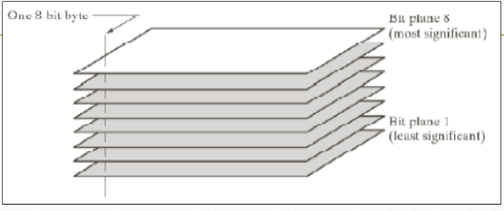
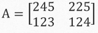
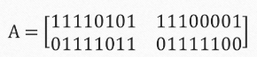
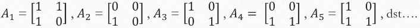
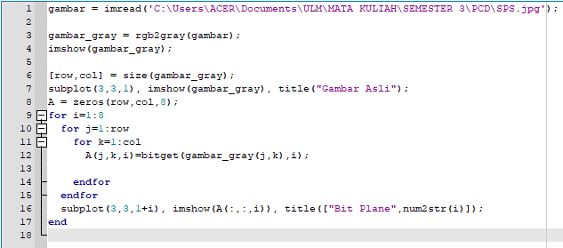
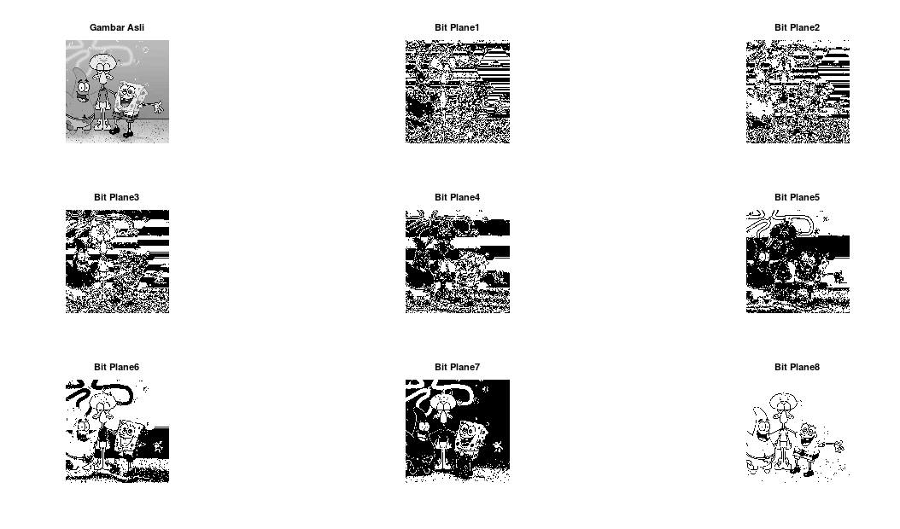

<h1 align="center"><b>TUGAS 5</b></h2>

<h1 align="center"><b>Pemrosesan Citra Digital</b></h2>

 

## __Bit Plane Slacing dan Steganography__

### __1. Bit Plane Slacing__
- Penjelasan

&ensp;&ensp;&ensp;&ensp;Secara digital sebuah gambar merupakan representasi dari sejumlah pixel. Pixel ini dapat diekspresikan lebih lanjut dalam bentuk bit. Bit-plane slicing merupakan metode yang digunakan untuk melihat konstribusi atau pengaruh tiap bit penyusun citra. Untuk citra 8 bit, pada dasarnya tiap intensitas yang nilainya dalam format decimal, bisa dipecah menjadi bit-bit dalam format biner. Misalnya, sebuah pixel dengan intensitas 245 (decimal) bila dijadikan biner adalah 11110101.

Misalkan diberikan citra grayscale berukuran 2x2 dengan nilai matriks sebagai berikut : 

jika nilai di intensitas pixel diubah kedalam biner akan menghasilkan :

&ensp;&ensp;&ensp;&ensp;Kemudian secara berurutan mengambil bit-bit untuk setiap intensitas dan dimasukan kedalam matriks baru. sehingga nanti akan mendapatkan 8 buah matriks baru yang berisi bit-bit urutan yang sama.

&ensp;&ensp;&ensp;&ensp;Tiap Matriks tersebut merupakan tiap slice dari sebuah gambar A. Tiap slice ini sudah menjadi citra biner dengan sendirinya. Tiap slice akan memberikan informasi dan menunjukan kontribusi dalam penyusun sebuah citra. A1 merupakan layer paling bawah dari gambar A (least significant), A8 merupakan layer paling atas dari gambar A (most significant).
&ensp;&ensp;&ensp;&ensp;

- Implementasi Pada Octave

Kode Program :

Penjelasan Kode :

- Pertama mengambil gambar dengan imread yang di masukan ke variabel gambar, setelah itu gambar tadi dibuat menjadi grayscale dengan fungsi rgb2gray dan di masukan dalam variabel gambar_gray.
- Mengambil size baris dan kolom pada gambar tadi kemudian akan menampilkan gambarnya dengan ukuran 3x3 pada posisi 1 menggunakan subplot lalu menampilkan gambar menggunakan imshow, dan membuat titlenya menjadi “Gambar asli”
- Selanjutnya membuat matriks A dengan isi 0 semuanya dengan ukuran yang sama dengan gambar, dan 8 layer karena nanti tiap bit akan dipisah menjadi 8 layer
- kemudian akan menampilkan layer satu persatu menggunakan perulangan dan di tampilkan dengan ukuran 3x3 dan posisi yang terus diupdate +i
- Lalu menggunakan title Bit Plane dengan tambahan i yang di ubah menjadi string.

Output :

&ensp;&ensp;&ensp;&ensp;Dari output tersebut terlihat Bit Plane 1 merupakan layer paling bawah yang gambarnya sangat tidak significant dengan gambar asli dan Bit Plane 8 merupakan Layer paling atas yang gambarnya lebih significant dengan gambar asli.
