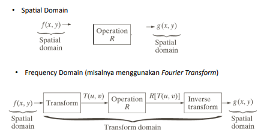
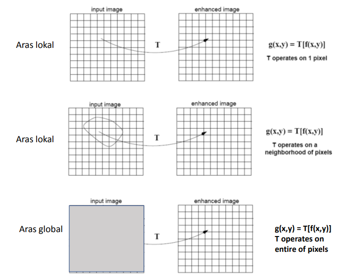

<h1 align="center"><b>TUGAS 6</b></h2>

<h1 align="center"><b>Pemrosesan Citra Digital</b></h2>

 

## __Metode Spatial Domain & Frequency Domain dalam Image Enhanchement__

### __Image Enhanchment__

&ensp;&ensp;&ensp;&ensp;Image enhancement adalah proses mendapatkan citra yang lebih mudah diinterpretasikan oleh mata manusia (Human Visual System/HVS). Proses ini merupakan salah satu proses awal dalam pengolahan  citra (image preprocessing). Untuk meningkatkan kualitas hasil proses image enhancement maka lebih  baik manipulasi citra dilakukan dalam domain  frekuensi. Beberapa jenis transformasi yang dapat digunakan untuk mengubah citra dari domain spasial ke domain frekuensi antara lain, transformasi fourier, transformasi gelombang-singkat (wavelet transform), Discrete Cosine Transform (DCT), dan sebagainya. Citra yang terbentuk menjadi berkualitas buruk karena mengalami derau (noise) pada saat pengambilan (capture) gambar, pengiriman melalui saluran transmisi, terlalu terang/gelap, kurang tajam, kabur dan sebagainya.

Berdasarkan ranah (domain) operasinya, metode-metode untuk perbaikan
kualitas citra dapat dikelompokkan menjadi dua kategori:
1. Image enhancement dalam ranah spasial
2. Image enhancement dalam ranah frekuensi

- __Metode dalam Ranah Spasial__

Misalkan:

- f(x,y) : citra input
- g(x,y) : citra output
- T adalah operator terhadap f

Metode pemrosesan citra dalam ranah spasial dinyatakan sebagai:

    g(x,y) = T [ f(x,y) ]

T bisa beroperasi pada satu pixel, sekelompok pixel bertetangga, atau keseluruhan pixel di dalam citra.

Jadi, metode dalam ranah spasial dapat dilakukan pada aras titik (pixel), aras lokal, dan aras global. 

Proses-proses yang termasuk ke dalam perbaikan kualitas citra:

- Pengubahan kecerahan gambar (image brightening)
- Citra negatif (image negatives)
- Peregangan kontras (contrast stretching)
- Pengubahan histogram citra.
- Pelembutan citra (image smoothing)
- Penajaman (sharpening) tepi (edge).
- Pewarnaan semu (pseudocolouring)
- Pengubahan geometrik
- dll

 

- __Metode dalam Ranah Frekuensi__

Metode dalam Ranah frekuensi memanipulasi citra dalam domain frekuensi dengan teknik transformasi Fourier.

Transformasi Fourier memungkinkan dilakukannyabeberapa hal yang tidak dapat dilakukan pada ranah spatial.

Banyak operasi dapat dilakukan dengan lebih cepat dalamranah Fourier dibandingkan dalam ranah spatial

Filtering dalam ranah Fourier jauh lebih efisien dibandingfiltering dalam ranah spatial, terutama untuk filter-filter besar.

Dengan transformasi Fourier, kita dapat memprosesfrekuensi-frekuensi spesifik. Dengan demikian, proses low-dan high-pass filtering dapat dilakukan dengan lebihpresisi