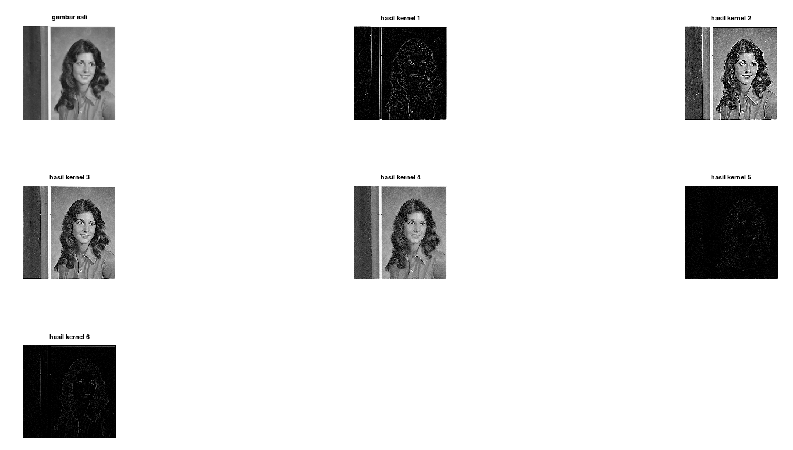
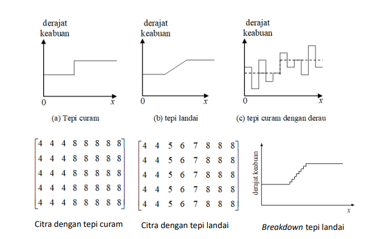
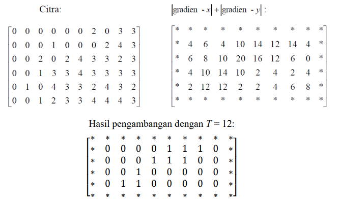
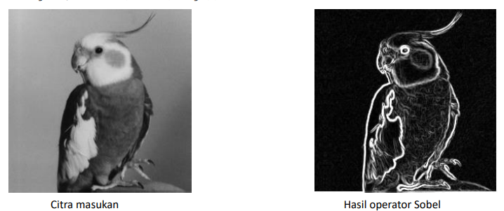
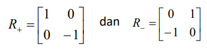
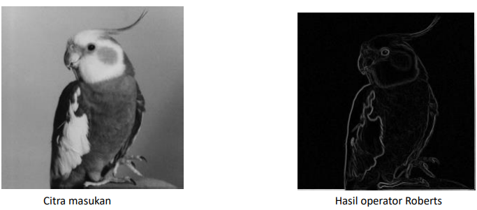
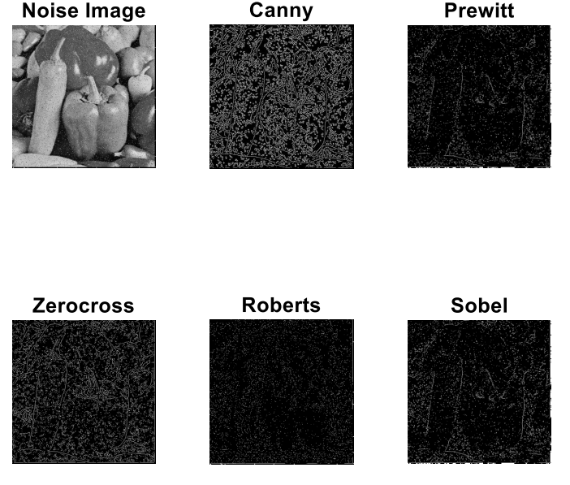

<h1 align="center"><b>TUGAS 7</b></h2>

<h1 align="center"><b>Pemrosesan Citra Digital</b></h2>

### __KELOMPOK 10 :__
- Khoyrur Roykhan
- Delphia Aryana
- Naila Hasanah

 

### __LOW-PASS FILTERING & HIGH-PASS FILTERING__

 

### __1. Low-Pass Filtering__

&ensp;&ensp;&ensp;&ensp;Low-pass filtering adalah proses filter yang melewatkan komponen citra dengan nilai intensitas yang rendah dan meredam komponen citra dengan nilai intensitas yang tinggi. Low pass filter akan menyebabkan citra menjadi lebih halus dan lebih blur.

__Aturan kernel untuk low-pass filter adalah:__
1. Semua koefisien kernel harus positif
2. Jumlah semua koefisien kernel harus sama dengan 1

Contoh kernel  yang dapat digunakan pada low-pass filtering adalah

Low-pass filtering menggunakan kernel (iii) disebut juga neighborhood averaging. 

### - __Low Pass Filtering Menggunakan Octave__

Hasil :

- Citra Asli

- Citra Menggunakan Kernel 1

- Citra Menggunakan Kernel 2

- Citra Menggunakan Kernel 3

### __2. High-Pass Filtering__

&ensp;&ensp;&ensp;&ensp; <i>High Pass Filter</i> (HPF) adalah proses filter yang mengambil citra dengan gradiasi intensitas yang tinggi dan perbedaan intensitas yang rendah akan dikurangi atau dibuang. <i>High Pass Filtering</i> adalah salah satu dari metode penajaman <i>(sharpening).</i> 

&ensp;&ensp;&ensp;&ensp; Tujuan utama dari proses penajaman ini adalah untuk menyoroti detail-detail halus dalam gambar atau untuk meningkatkan detail yang telah dikaburkan baik dalam kesalahan atau efek alami dari proses akuisisi citra tertentu.

### __Kegunaan__

- __High-Pass Filter__ sering disebut juga sebagai filter penajaman tepi __(edge sharpening)__ karena HPF digunakan dalam proses penajaman citra. 
- Operasi penajaman citra bertujuan untuk memperjelas tepi pada objek di dalam citra atau menghilangkan bagian citra yang lembut.
- Karena penajaman citra lebih berpengaruh pada tepi __(edge)__ objek, maka penajaman citra sering disebut juga penajaman tepi __(edge sharpening)__ atau peningkatan kualitas tepi __(edge enhancement)__.

### __Aturan-Aturan Dalam High-Pass Filter__

1. Koefisien penapis boleh negatif, nol, ataupun bernillai positif.
2. Total keseluruhan koefisiennya ialah bernilai 0 ataupun 1.
3. Apabila jumlah koefisiennya berjumlah = 0, maka setiap elemen yang rendah frekuensinya nilainya akan menurun. 
4. Namun, apabila total dari koefisien adalah = 1, maka elemen yang memiliki frekuensi rendah nilainya tetap sama dengan nilai semula.

### - __High Pass Filtering Menggunakan Octave__

Output :

### __3. High-Boost Filtering__

### __4. Median Filtering__

### __5. Edge Detection__

Tepi (edge) adalah perubahan nilai intensitas derajat keabuan yang mendadak (besar) dalam jarak yang singkat. Tepi memiliki arah, dan arah ini berbeda-beda bergantung pada perubahan intensitas Tepi biasanya terdapat pada batas antara dua daerah yang berbeda intensitas dengan perubahan yang sangat cepat di dalam citra. 

Empat macam tepi: 
- tepi curam (step edge), 
- tepi landai (ramp edge), 
- tepi garis (line edge), dan 
- tepi atap (roof edge).

### __Tujuan Pendeteksian Tepi__

- Pendeteksian tepi bertujuan untuk meningkatkan penampakan garis batas atau objek di dalam citra.
- Pendeteksian tepi mengekstraksi representasi gambar garis-garis di dalam citra.
- Pendeteksian tepi berguna dalam mengenali objek di dalam citra (image recognition).

 

### __Operator Gradien__
- Oparator Sobel
- Oparator Roberts
- Oparator Prewitt
- Operator Canny

 
#### __1. Operator Sobel__

Di bawah ini contoh lain pendeteksian tepi dengan operator Sobel, dimana hasil konvolusi diambangkan (thresholding) dengan T = 12.

#### Operator Sobel Menggunakan Fungsi Octave
- Kode :

- Output :

 

#### __2. Operator Prewitt__
Persamaan gradien pada operator Prewitt sama seperti operator Sobel, tetapi menggunakan nilai c = 1 :

Kekuatan tepi dihitung dengan rumus :

#### Operator Prewitt Menggunakan Fungsi Octave

- Kode :

- Output :

 

#### __3. Operator Roberts__

Operator Roberts sering disebut juga operator silang

Gradien Roberts dalam arah-x dan arah-y dihitung dengan rumus :

Dalam bentuk mask konvolusi :

- Contoh berikut ini memeperlihatkan pendeteksian tepi dengan operator Roberts :

#### Operator Roberts Menggunakan Fungsi Octave
- Kode :

 

- Output :

#### __4. Operator Canny__

Operator deteksi tepi yang terkenal karena dapat menghasilkan tepi dengan ketebalan 1 pixel

Langkah-langkah operator Canny:
- Haluskan citra I dengan penapis Gaussian: G * I
- Hitung gradien setiap pixel dengan salah satu dari 4 operator sebelumnya (misalnya operator Sobel)
- Jika nilai mutlak gradien suatu pixel melebihi nilai ambang T, maka pixel termasuk pixel tepi.
 

#### __Perbedaan Hasil Keempat Operator__

