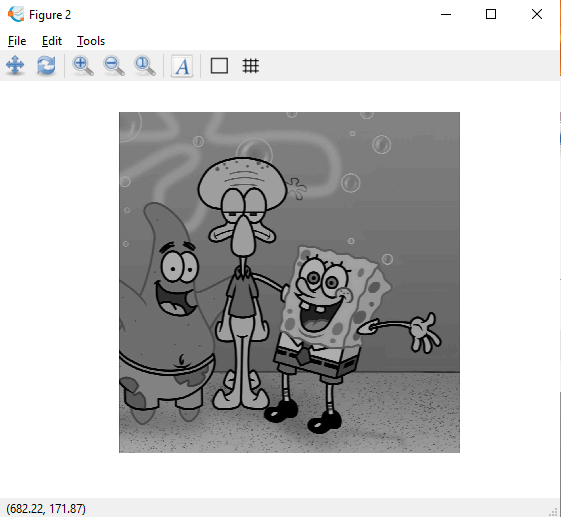
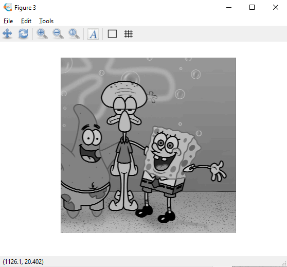

<h1 align="center"><b>TUGAS 7</b></h2>

<h1 align="center"><b>Pemrosesan Citra Digital</b></h2>

### __KELOMPOK 10 :__
- Khoyrur Roykhan
- Delphia Aryana
- Naila Hasanah

 

### __LOW-PASS FILTERING & HIGH-PASS FILTERING__

 

### __1. Low-Pass Filtering__

&ensp;&ensp;&ensp;&ensp;Low-pass filtering adalah proses filter yang melewatkan komponen citra dengan nilai intensitas yang rendah dan meredam komponen citra dengan nilai intensitas yang tinggi. Low pass filter akan menyebabkan citra menjadi lebih halus dan lebih blur.

Aturan kernel untuk low-pass filter adalah:
1. Semua koefisien kernel harus positif
2. Jumlah semua koefisien kernel harus sama dengan 1

Contoh kernel  yang dapat digunakan pada low-pass filtering adalah

Low-pass filtering menggunakan kernel (iii) disebut juga neighborhood averaging. 

Contoh perintah untuk melakukan low-pass filtering adalah:

Hasil :

- Citra Asli

- Citra Menggunakan Kernel 1

- Citra Menggunakan Kernel 2

- Citra Menggunakan Kernel 3

